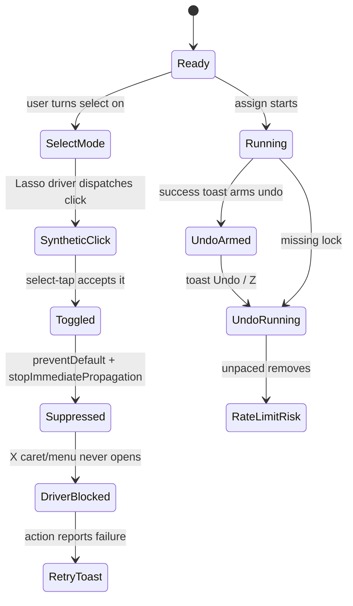
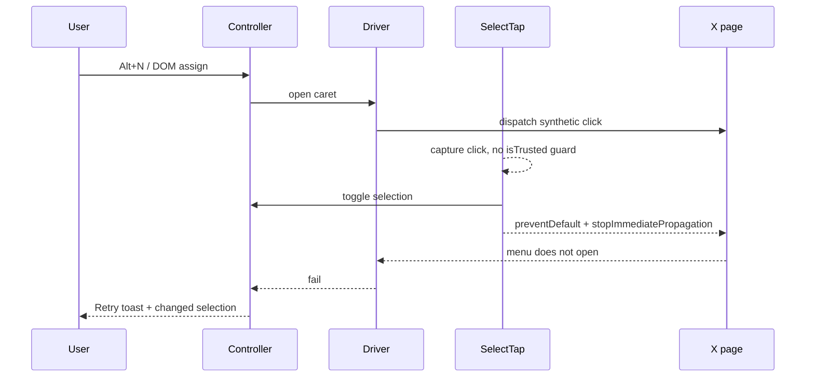
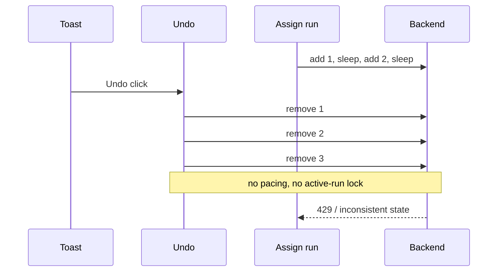

# Lasso critical review - 2026-07-19

Scope: current working tree, 151 changed files. Recent PRs #11-#15. Read-only. No edits. No tests run.

Verdict: REQUEST CHANGES.

Critical: none found. No committed secrets. No runtime `innerHTML` in `src/`. `git diff --check` clean. LSP clean.

## Main risks

## Findings

### W1. Chrome floor lies
What: the manifest says Chrome 106. Code uses newer APIs.  
Evidence: `src/manifest.config.ts:33`; `URL.canParse` at `src/options/OptionsApp.tsx:66`; `toSorted`/`toReversed` at `src/core/list-cache.ts:87`, `src/core/picker-controller.ts:186`, `src/core/list-usage.ts:66`, `src/core/fuzzy.ts:26`, `src/content/main.tsx:164`.  
Why: Chrome 106-119 can throw at runtime. Options can brick. Content rollback can throw.  
Fix: raise the floor to Chrome 120, or replace the APIs.

### W2. Select mode eats Lasso's own clicks
What: select-tap has no trusted-event guard. It also still lacks the outermost-tweet fix.  
Evidence: `src/content/select-tap.ts:21-29`; synthetic clicks at `src/core/x-client/caret-actions.ts:118-128` and `src/core/x-client/dom-page-driver.ts:8`; current target code at `src/content/main.tsx:303-313`. PR #12 has the outermost fix.  
Why: with select mode on, a Lasso driver click can toggle selection and suppress the real action. X never opens the caret menu. A quoted-tweet tap can still pick the inner author.  
Fix: ignore `!isTrusted` and flagged synthetic events. Resolve `outermostTweet`. Land PR #12.

### W3. Undo breaks the mutation policy
What: adds are paced. Removes are not. Toast Undo can also run during an active assign.  
Evidence: paced adds at `src/core/actions/assign-to-list.ts:44-48`; unpaced removes at `src/content/controller.ts:210-231`; toast Undo at `src/content/controller.ts:312-319`; assign guard only at `src/content/controller.ts:240-247`. PR #11 has the pacing fix, not this tree.  
Why: policy says one gesture, human pace, stop on rate limit. Undo now can fire many removes at once, during adds.  
Fix: forward-port PR #11. Keep per-attempt `observedAt`. Block undo while `activeAssignment`.

### W4. Undo toast dies before undo
What: success toast auto-dismisses in 4s. Undo stays armed for 10s.  
Evidence: `src/core/assign-feedback.ts:106-110`; default toast time at `src/core/toast-store.ts:73-83`; window at `src/content/controller.ts:38-39`.  
Why: Z still works after the button is gone. Invisible undo.  
Fix: set success `durationMs` to the undo window. PR #15 had this idea.

### W5. Device key still syncs
What: the Mirror device key sits in settings, and settings use `chrome.storage.sync`.  
Evidence: `src/core/storage-keys.ts:12-13`; `src/core/settings.ts:169-173`.  
Why: sync replicates data through the user's browser account. This fights the local-only privacy claim.  
Fix: move settings to local storage. Pass the storage area through `syncedStore`. Do not merge PR #15 as-is.

### W6. Filter presets can exceed sync quota
What: presets have no count or size cap. Writes fail soft.  
Evidence: `src/core/filter-store.ts:203-218`; `src/core/filter-store.ts:276-288`.  
Why: one large preset can break later filter writes. User edits can appear, then vanish.  
Fix: cap presets. Surface quota errors.

### W7. Mirror can latch dead
What: one failed adapter build marks the Mirror unavailable until settings change.  
Evidence: `src/core/membership-store/live.ts:148-160`; `src/core/membership-store/live.ts:171-186`.  
Why: a transient startup failure can disable the Mirror for the session.  
Fix: add bounded retry or manual retry.

### W8. Mirror reads hide failure
What: reactive observe swallows errors. HTTP fallback also emits nothing on failure.  
Evidence: `src/core/membership-store/convex-client.ts:60-79`; `src/core/membership-store/convex.ts:138-150`.  
Why: stale membership looks like loading. The user sees old checks.  
Fix: report read failure to mirror status. Emit an explicit error state.

### W9. Convex data grows without bound
What: old generations stay. Events append forever.  
Evidence: `convex/membership.ts:395-398`; `convex/schema.ts:58-74`.  
Why: deleted facts and handles remain. Cost and privacy risk grow.  
Fix: add the bounded garbage collector.

### W10. Hidden posts stay selectable
What: the filter stub gate exists, but callers do not use it.  
Evidence: gate documented at `src/content/filter-applier.ts:35-41`; exposed at `src/content/filter-feature.ts:15-20`; not used at `src/content/main.tsx:309-313` or `src/content/main.tsx:373-381`.  
Why: a collapsed post can still be selected or assigned.  
Fix: check `isStubbed` before overlay and select.

### W11. Wrong failure copy for unmute
What: failed unmute says "Couldn't mute".  
Evidence: `src/content/controller.ts:451-459`; strings at `src/core/strings.ts:65` and `src/core/strings.ts:119`; test codifies it at `tests/content/controller.test.ts:1472-1480`.  
Why: literal failure copy is wrong at the moment of loss.  
Fix: add `unmuteFailedLine`. Update the test.

## Smaller fixes
- GraphQL features are too thin: `src/core/x-client/graphql-config.ts:21-24`.
- Cookie parse can throw or misread: `src/core/x-client/auth.ts:39-46`.
- 401/403 short-circuit loses X error codes: `src/core/x-client/x-http.ts:75-115`.
- `useSignalValue` can go stale on signal swap: `src/ui/use-signal-value.ts:8-11`.
- No-match state can leave a dangling `aria-activedescendant`: `src/ui/ListPicker.tsx:128-165`.
- External settings echoes can erase Mirror typing: `src/options/OptionsApp.tsx:208-215`, `src/options/OptionsApp.tsx:229-260`.
- CSP should use `object-src 'none'`: `src/manifest.config.ts:35-38`.
- Avatar URLs should be allowlisted: `src/ui/ActionBar.tsx:277-288`.

## PR notes
- #11: good fix. Forward-port. Add `observedAt`. Add active-run guard.
- #12: land it. Current tree still has the quoted-tweet bug.
- #13: fine. Test-only deflake.
- #14: do not merge as-is. Current tree already has mutation-only `XListApi` and owner-qualified `ListCache`. PR #14 adds unvalidated cache reads, treats empty cache as cold, and turns membership failure into `[]`.
- #15: do not merge. It has real fixes, but it is stale and predates `synced-store`. Its settings-local patch would break cross-context settings unless the area is passed through.

## Fix order
1. Select-tap: trusted guard, synthetic guard, outermost tweet, stub gate.
2. Undo: pacing, active-run lock, toast lifetime, unmute copy.
3. Chrome floor: raise to 120 or remove new APIs.
4. Settings: move device key off sync storage.
5. Mirror: retry, read-error state, Convex GC.
6. Quota: cap filter presets.
