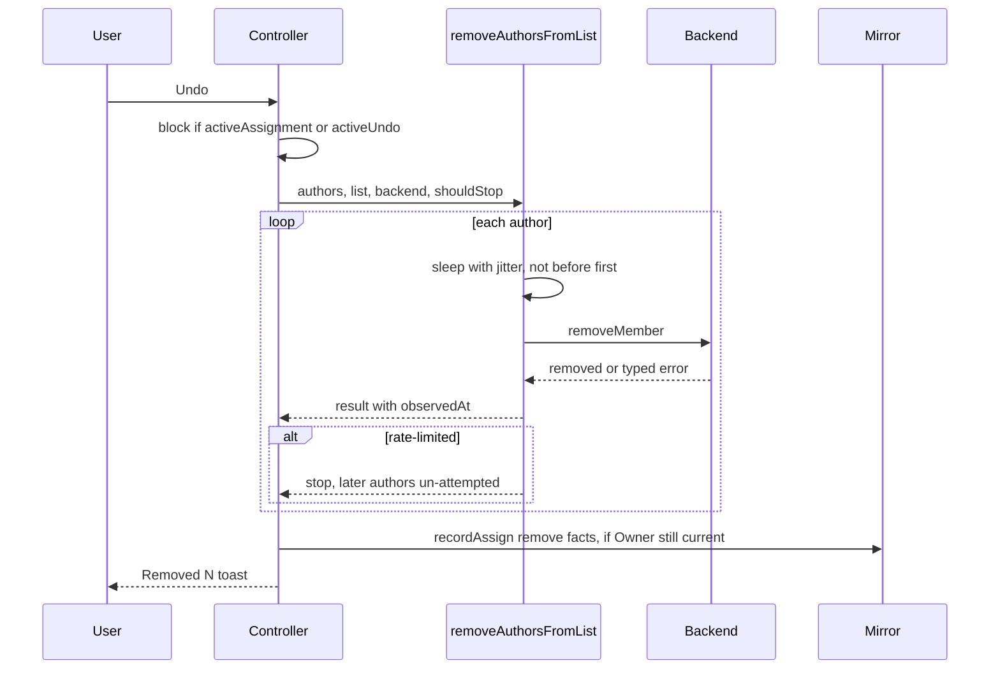
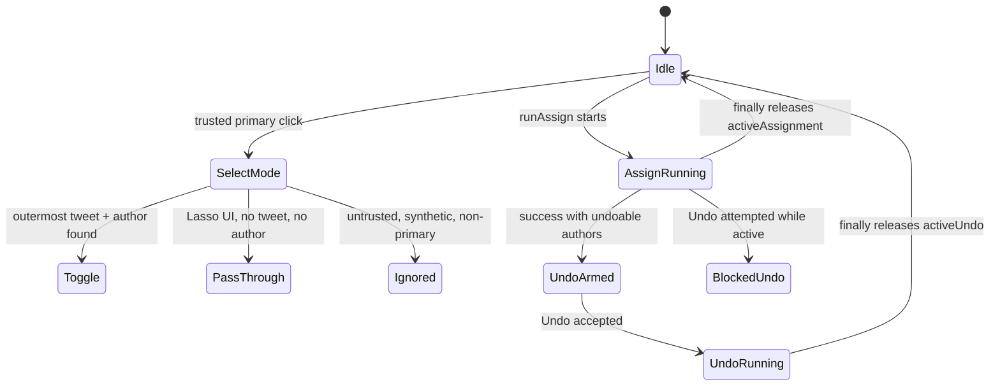
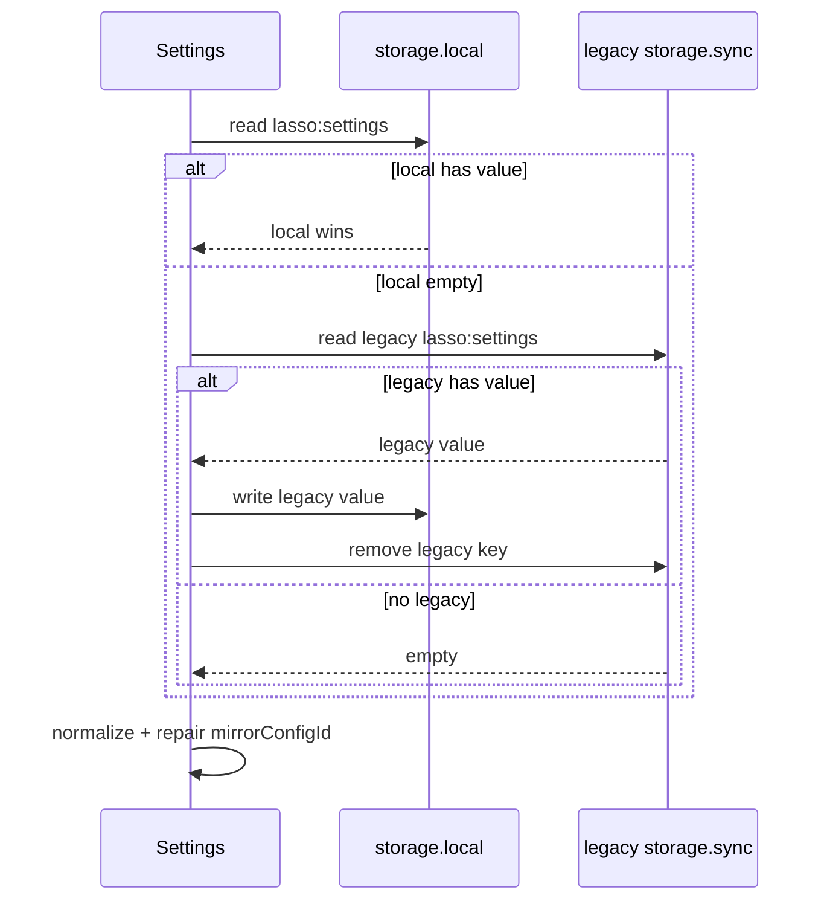

# Final tech report - 2026-07-19

Scope: fixes after read-only review. Sequence: select-tap -> undo -> Chrome floor -> settings storage. MD focuses on proof. HTML focuses on visual read.

Verification: full suite 92 files / 1334 tests passed. `typecheck` passed. `format:check` passed. `lint` passes with 5 warnings for the intentional Chrome-106-safe `sort`/`reverse` replacements.

## What changed and why

| Change | Where | Why | Quality effect |
|---|---|---|---|
| Select-tap accepts only trusted primary clicks. It ignores Lasso's flagged synthetic events. | `src/content/select-tap.ts:23-36` | Lasso drivers dispatch clicks inside tweets. Select mode could toggle and suppress the driver. | Stops self-intercept. Stops false Retry toasts. |
| Select-tap resolves the outermost tweet. | `src/content/main.tsx:303-308` | Quoted tweets nest articles. The outer article owns author and caret. | Prevents wrong-author selection. |
| Undo removals are paced and stop on rate-limit. | `src/core/actions/assign-to-list.ts:70-120` | Adds were paced. Removes were not. Both hit the same rate-limited API family. | Undo now follows the same mutation policy as assign. |
| Undo carries per-attempt time. | `src/core/actions/assign-to-list.ts:103-115`, `src/content/controller.ts:225-232` | Mirror facts need the time each X attempt settled. | Cleaner audit facts. |
| Undo cannot overlap an active assign. Assign cannot overlap an active undo. | `src/content/controller.ts:214-243`, `src/content/controller.ts:245-250` | Toast Undo could start while a run was active. | Removes concurrent mutation interleaving. |
| Undo toast lives for the undo window only when Undo exists. | `src/core/assign-feedback.ts:107-115` | Success toast used the 4s default. Undo stayed armed for 10s. | No invisible undo. No needless 10s toast when nothing can be undone. |
| Chrome-floor APIs were replaced. | `src/options/OptionsApp.tsx:65-72`, `src/content/main.tsx:164`, `src/core/picker-controller.ts:186`, `src/core/list-cache.ts:87`, `src/core/list-usage.ts:66`, `src/core/fuzzy.ts:26` | Manifest says Chrome 106. `toSorted`, `toReversed`, and `URL.canParse` need newer Chrome. | Prevents runtime TypeError on Chrome 106-119. Still works on Chrome 150+. |
| Settings moved to local storage. Legacy sync migrates once. | `src/core/settings.ts:177-208`, `src/core/storage-keys.ts:12-15`, `src/core/storage-keys.ts:22-30` | The Mirror device key should not replicate through `chrome.storage.sync`. | Better privacy. Local-first claim matches behavior. Clear still wipes legacy sync. |
| Explicit Mirror clear stays cleared. | `src/core/settings.ts:70-81`, `src/core/settings.ts:266-280` | Chrome storage drops `undefined` inside objects. A clear could refill a dev default credential. | Explicit opt-out sticks. |

## Time sequence diagram

## State machine illustration

## Settings migration sequence

## Failure classes, root causes, avoidance

| Failure class | Root cause | Avoid while coding | Guard |
|---|---|---|---|
| Event trust confusion | Capture-phase listeners accepted every event. Some driver events were unmarked. | Default deny: ignore `!isTrusted`. Mark every synthetic event with `SYNTHETIC_EVENT_FLAG`. | Test each listener with trusted, untrusted, flagged, aux clicks. |
| Nested DOM targeting | `closest(Selectors.TWEET)` stops at the quoted inner article. | For author/caret actions, resolve the outermost tweet. Keep one resolver. | Fixture with nested `article[data-testid="tweet"]`. |
| Asymmetric mutation policy | Pacing lived in the add path only. Undo reused a raw loop. | One policy function per mutation verb. Share pacing, STOP, outcome mapping. | Rate-limit tests for add and remove. |
| Missing async lock | Keyboard path consumed commands during a run. Toast Undo bypassed it. | Token locks in the conductor. Check the lock in the action itself. Release in `finally`. | Deferred backend test: start run, fire old Undo, prove no remove. |
| Version floor drift | Manifest floor said Chrome 106. Lint env said ES2024. Code used newer APIs. | Treat `minimum_chrome_version` as an API budget. Map each new API to a Chrome version before use. | Align `.oxlintrc.json` env with the floor; add a banned-API check. |
| Secret storage drift | Settings storage predated the Mirror credential. | Classify every key in `storage-keys.ts`: secret or not, local or sync. Credentials default local. | Storage-boundary test proves the credential area. |
| Sentinel loss in JSON storage | Chrome storage drops object fields set to `undefined`. Defaults then refilled. | Encode explicit clear as `null` only at the storage edge. Normalize `null` back to `undefined`. | Test clear -> reload -> still cleared. |
| Timer lifetime mismatch | Toast default and undo window were owned by different modules. | One source for the window. UI duration derives from it. | Test toast duration equals the armed undo window. |

## Better discipline and oxlint suggestions

- Align lint env with runtime floor. `.oxlintrc.json:11` sets `env.es2024: true`; `src/manifest.config.ts:33` says Chrome 106. Set the lint env to the floor, or add an override for app code.
- Ban floor-breaking APIs. If this oxlint version supports `no-restricted-syntax`, ban `toSorted`, `toReversed`, `toSpliced`, `with`, and `URL.canParse`. If not, run one tiny `lint:chrome-floor` script until oxlint has a browser-compat rule.
- Keep `unicorn/no-array-sort` and `unicorn/no-array-reverse` useful without fighting the floor: centralize old-Chrome sort/reverse in one reviewed compat helper, then forbid ad-hoc copies elsewhere.
- Add a custom rule later: `lasso/require-trusted-event-guard` for document-level `click`, `keydown`, and `mousemove` listeners. Until then, keep the checklist in review: every listener must say why trusted input is safe.
- Keep architecture rules in tests, not comments: storage-key classification, mutation pacing, async locks, and API floor should each have one failing test when broken.

## Did this significantly improve code quality?

Yes. It removes failure classes, not style noise: driver self-block, wrong-author selection, unpaced undo mutations, old-Chrome crashes, credential sync replication, and refill-after-clear. Tests now pin each behavior.

Residual risk: lint still warns about `sort`/`reverse`; that is intentional for Chrome 106. Remaining gaps: Mirror retry/GC, filter preset quota, hidden-post selection gate, unmute failure copy, GraphQL feature flags, PR #14/#15 need rework rather than merge.
