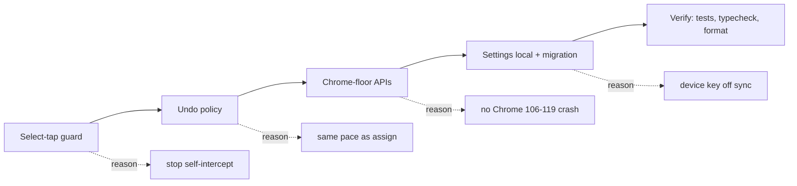
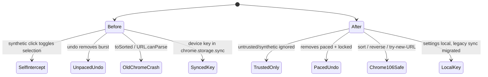
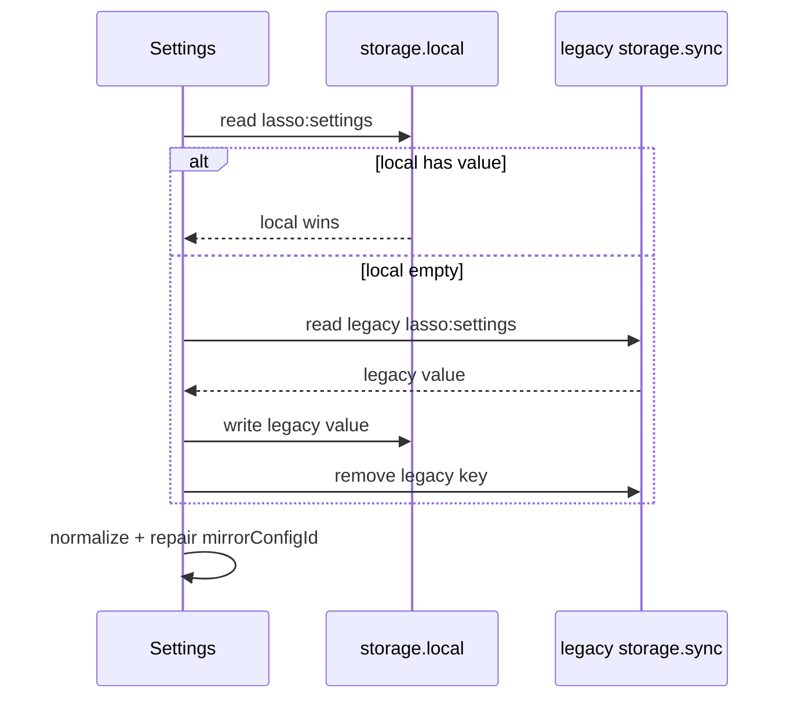

# Summary tech report - 2026-07-19

Sequence used: select-tap -> undo -> Chrome floor -> settings storage.

Checks: full suite 92 files / 1334 tests passed. `typecheck` passed. `format:check` passed. `lint` passes with 5 warnings for the intentional Chrome-106-safe `sort`/`reverse` replacements.

## What changed, why, quality effect

| Step | Change | Why | Quality effect |
|---|---|---|---|
| 1. Select-tap | Ignore untrusted, synthetic, non-primary clicks. Resolve outermost tweet. | Lasso drivers dispatch clicks inside tweets. Select mode could toggle and suppress the driver. Quoted tweets could pick the inner author. | Removes self-intercept. Removes wrong-author taps. Fewer false Retry toasts. |
| 2. Undo | Add paced `removeAuthorsFromList`. Stop on rate-limit. Carry `observedAt`. Block undo during an active assign. Keep Undo toast visible for the undo window. | Adds were paced. Removes were not. Toast Undo could overlap a run. Toast died at 4s while undo lived 10s. | Undo now follows the same policy as assign. Less rate-limit risk. No invisible undo. Cleaner Mirror facts. |
| 3. Chrome floor | Replace `toSorted`, `toReversed`, `URL.canParse`. | Manifest says Chrome 106. Those APIs need newer Chrome. | Prevents runtime TypeError on Chrome 106-119. Keeps Chrome 150+ working too. |
| 4. Settings storage | Move settings to `chrome.storage.local`. Migrate legacy sync once. Store explicit Mirror clear as `null`. | The Mirror device key should not replicate through sync. A cleared dev credential must not refill from defaults. | Better privacy. Local-first claim matches behavior. Explicit opt-out sticks. |

## Sequence diagram

## Before -> after

## Settings migration

## Did code quality significantly improve?

Yes. Not style-only. It removes four failure classes: driver self-block, wrong-author selection, unpaced undo mutations, and old-Chrome runtime crashes. It also moves the one long-lived credential out of sync storage. Tests now pin the behavior: select-tap guards, quoted-tweet targeting, paced undo, undo lock, toast lifetime, Chrome-floor replacements, local migration, explicit clear.

Residual risk: lint still warns about `sort`/`reverse` because the rule prefers `toSorted`/`toReversed`. That is intentional for Chrome 106. Remaining known gaps: Mirror retry/GC, filter preset quota, hidden-post selection gate, unmute failure copy, GraphQL feature flags, PR #14/#15 need rework rather than merge.
