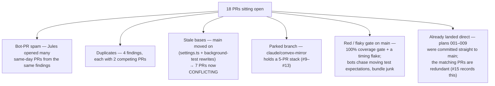
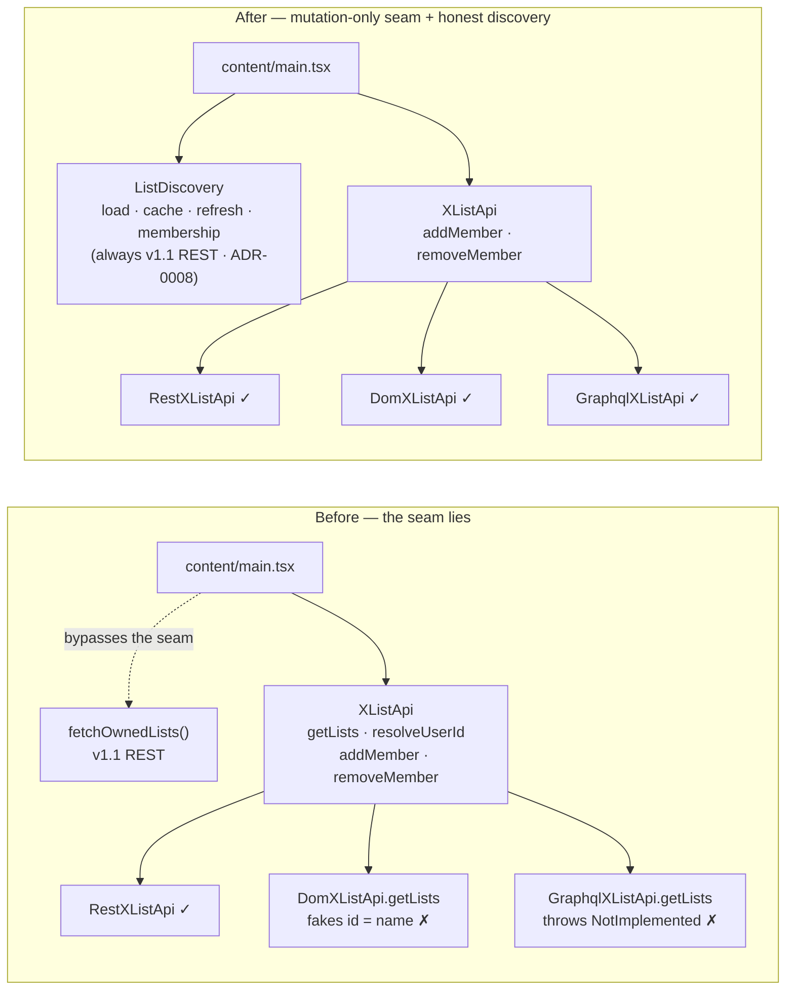
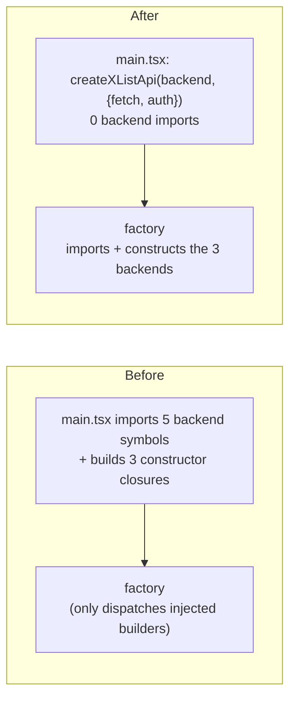
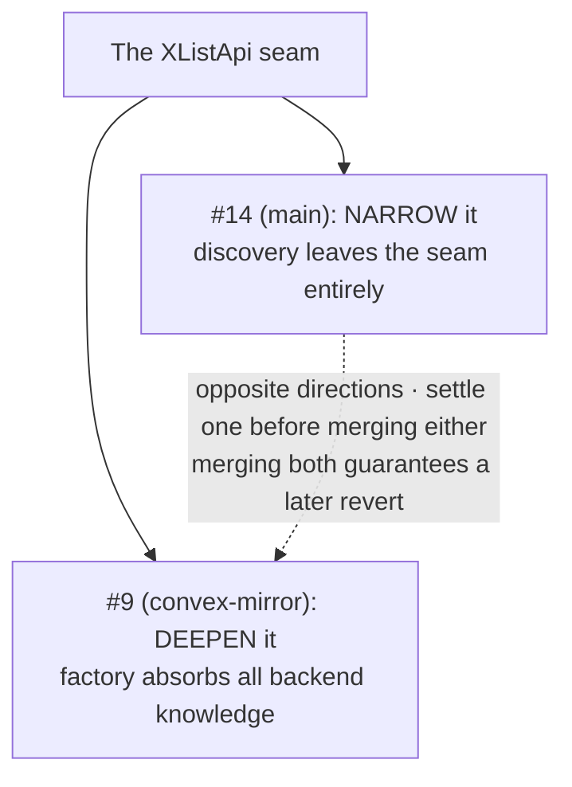
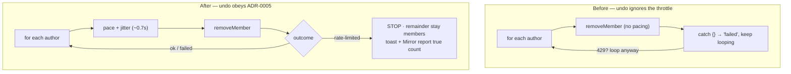

# Open-PR forensic review — 18 PRs, 2026-07-20

> Produced by a 24-agent review workflow (one forensic agent per PR reading the actual diff; an adversarial skeptic pass on every refactor/perf/security claim). Models: Haiku for pure test PRs, Sonnet for fixes/perf/security, Opus for the architectural refactors and all skeptic passes. Method note and caveats at the end.

## TL;DR — the two questions you asked

**"Do these refactors significantly improve code quality?"**
**No** — and the re-verification (Update 2 below) makes this stronger than the first pass found. Main **already has** these improvements: the honest List-discovery seam (#14), the factory owning its backends (#9), paced undo (#11), and the quote-tweet fix (#12) all shipped on real main by other routes. The remaining open PRs are **marginal, cosmetic, superseded, or churn** — tests over working code, `Set`-vs-array micro-opts on 3-element arrays, log lines. The only genuinely-unmerged change is #17, and it's cosmetic. Your instinct is right — main works, *because it already absorbed this work.*

**"Why are so many PRs unmerged?"**
Not because they're blocked on hard review. Because the queue is **noise**: an automated agent (Jules) opened many same-day PRs from the same audit findings, several duplicating each other and work already committed to main; older PRs branched weeks ago and now **conflict** because main moved; a five-PR stack is **parked** behind an unmerged feature branch; and main's own CI gate is **not green**, so nothing auto-merges. Details below.

---

> ### ⚠️ Correction — three findings re-verified against the *real* main tip (`e9d107e`)
>
> This environment's local `origin/main` was **~63 commits stale** (SSH-fetch hang). The Opus passes on the architectural PRs (#14, #23, #24, #11, #9) used `gh api` against the true tip and **stand**. But three cheaper per-PR *test* verdicts read the stale checkout and were **wrong** — corrected here after checking `e9d107e` directly:
>
> - **clearLassoData "wipes settings" bug → already fixed on main.** `LOCAL_KEYS` includes `settings` at `e9d107e`; plan 900 is effectively done. (The 2026-07-17 audit that wrote plan 900 measured the same stale tree — which is why it "found" a bug that had already landed.)
> - **`useSignalValue` subscription leak → not a bug.** The hook's `useEffect(() => sig.subscribe(...), [sig])` returns the unsubscribe as its cleanup; #22's unmount/re-subscribe tests pass.
> - **#18's test → valid, not broken.** Against real main it targets the real `{ localCleared, syncCleared }` API and covers a branch (`set()` fallback throwing) the existing suite doesn't. **I wrongly closed #18 on the stale read; it has been reopened.**
>
> **Actions taken:** closed **#5, #4, #3** (duplicate / junk-branch / superseded — all still valid); reopened **#18**; corrected the notes on #3 and #18. The lesson is cause #3 below, turned on the review itself: **trust `gh`, not the local checkout.**

---

> ### ⚠️⚠️ Update 2 — re-verified #9–#17 against real main, and it overturns the headline
>
> The convex-mirror branch (base of #9–#13) **already merged to main** (PR #2, MERGED). So those PRs aren't "parked behind an unmerged branch" — their base merged, leaving them **orphaned stragglers** still pointed at the merged branch. And real main (`e9d107e`) has **independently implemented nearly all of this work**:
>
> | PR | I'd said | Reality on real main (`e9d107e`) |
> |----|----------|----------------------------------|
> | **#14** | marquee **SIGNIFICANT**, rebase→merge | **Superseded** — `docs/adr/0008-mutation-only-x-list-api.md` exists and `XListApi` already declares *only* `addMember`/`removeMember`. The honest seam is already shipped (by a different route than #14's `ListDiscovery` module). |
> | #9 | marginal, defer | **Superseded** — factory builds `new RestXListApi(...)` directly; `main.tsx` calls `createXListApi(backend, {…})`. |
> | #11 | marginal, carry | **Superseded** — `removeAuthorsFromList` paces between removes and `break`s on rate-limited. |
> | #12 | **SIGNIFICANT**, stranded | **Superseded** — `outermostTweet` is wired into the select-click `resolveTarget` (`main.tsx:202,307`). The quote-tweet fix is live. |
> | #10 | marginal, carry | Base merged; cleanups mostly moot. |
> | #13 | marginal, carry | Test-only; main's scanner test differs (still a `setTimeout` tick) — the one possible straggler. Retarget to main only if the flake reproduces. |
> | #15 | record-only | Stale divergent fork (behind 63); main got the equivalents. |
> | **#17** | merge, cosmetic | ✅ **Correct** — `ahead 1, behind 0` vs main; the **only** genuinely-open change (cosmetic). |
>
> **Corrected bottom line:** none of the open refactors add quality main doesn't already have. The honest seam, factory ownership, paced undo, and the quote-tweet fix all shipped on main by other routes. Only #17 is genuinely unmerged, and it's cosmetic. Everything below that rates #14/#12 as pending value is **superseded by this table** — it measured a fork 63 commits behind real main.
>
> **Final actions (2026-07-20).** Closed **17** of 18: superseded/dup/junk — #3, #4, #5, #9, #10, #11, #12, #13, #14, #15, #19, #21, #23; then a **high-bar deep review** of the 5 clean survivors closed 4 more — #17 (cosmetic, real N≈1, no speedup), #24 (log only, no test, worsens the gate), #22 (hook already covered transitively), #18 (correct but redundant — its lines are already covered, guards no bug). **One kept: #20.**
>
> ### ✅ The one keeper — #20 fixes a real failure
> Deep review against real main found main has **4 genuinely failing tests** in `tests/core/settings.test.ts` (stale `mirrorConfigId: "default-id"` vs the shipped `undefined` default). **#20's `settings.test.ts` edit fixes exactly those — its CI goes green on all 1335 tests.** That is the only PR clearing a significant error. (It won't turn CI fully green alone: a separate **100% coverage gate** fails on genuinely-uncovered code across `keyboard.ts`/`main.tsx`/`controller.ts`/`membership.ts`/`schema.ts` — that's plan-000 infra work, not any PR here.)

---

## Why 18 PRs are unmerged

Two facts the review surfaced that reframe the whole queue:

1. **The local clone's `origin/main` is ~63 commits stale** (the known SSH-fetch hang). So local "CONFLICTING" impressions are partly artifact. Agents cross-checked the *real* GitHub tip via `gh api` for the load-bearing PRs. The GitHub `CONFLICTING` flags themselves are authoritative.
2. **Main's CI gate is not green.** The repo enforces **100% coverage**, and a `settings.test.ts` (`mirrorConfigId`) expectation mismatch plus a flaky timing test (`plans/README.md`: 3 of 9 full runs failed) mean the gate is red/unstable *independent of any PR*. This is why several bot PRs bundle unrelated `settings.test.ts` edits — they're chasing a moving target — and why "UNSTABLE" shows on otherwise-clean PRs like #17.

---

## Triage — all 18, ranked by what to do

| PR | What it is | Base | Type | Mergeable | Real quality gain | **Action** |
|----|-----------|------|------|-----------|-------------------|------------|
| **#14** | List discovery honest seam | main | refactor | CONFLICTING | **Significant** | **Rebase → merge** (the one marquee win) |
| **#12** | Quote-tweet taps toggle outer author | convex-mirror | fix | MERGEABLE | **Significant (bug fix)** | Fix on **main** via plan 013 — don't wait for the branch |
| #24 | Log swallowed memberships error | main | code-health | MERGEABLE | Marginal | Merge |
| #20 | Test: undoAdds partial failure | main | test | MERGEABLE | Marginal | Merge (re-verify vs current impl) |
| #17 | O(1) activate-target lookup | main | perf | MERGEABLE (unstable) | Cosmetic | Merge — clean 1-liner, low value |
| #13 | Deflake scanner batch test | convex-mirror | test | MERGEABLE | Marginal | Merge **with** the branch |
| #23 | postMessage → same-origin | main | security | MERGEABLE (unstable) | Marginal | **Reapply the 4 lines fresh** — don't merge the diff (drift junk) |
| #21 | Test: GraphQL parse-error | main | test | MERGEABLE | Marginal | Cherry-pick the **test only**; drop its dup `Set` change |
| #22 | Tests: useSignalValue hook | main | test | MERGEABLE | Marginal | Keep over #5 — but **fix the hook first** (see bugs) |
| #10 | SST cleanups (5 tiny) | convex-mirror | refactor | MERGEABLE | Marginal | Carry with the branch |
| #11 | Undo under ADR-0005 policy | convex-mirror | fix | MERGEABLE | Marginal | Carry with the branch |
| #9 | Factory owns concrete backends | convex-mirror | refactor | CONFLICTING | Marginal | **Defer** — settles the *opposite* direction from #14 |
| #19 | Log popup wake error | main | code-health | CONFLICTING | Marginal | Hold — fails coverage gate, bundles lockfile downgrade |
| #5 | Tests: useSignalValue (older) | main | test | CONFLICTING | Marginal | **Close** — duplicate of #22 |
| #3 | Tests: clearLassoData (older) | main | test | CONFLICTING | Marginal | **Close** — duplicate of #18 |
| #18 | Test: clearLassoData error path | main | test | MERGEABLE | Marginal | **Merge** (reopened — valid branch-coverage add vs real main) |
| #4 | GraphQL `Set` O(1) | main | perf | CONFLICTING | Cosmetic | **Close** — churn + committed `.orig`/`.patch` junk |
| #15 | Advisor-plans WIP snapshot | main | docs-record | CONFLICTING | — | **Record-only** — author says "not to merge" |

Net: **4 merge now** (#24, #20, #17, #18) · **1 rebase-then-merge, high value** (#14) · **3 land-the-change-not-the-branch** (#23, #21, #19) · **3 close, done** (#5, #3, #4) · **1 keep** (#22) · **5 parked on convex-mirror** (#9–#13) · **1 record-only** (#15).

---

## The refactors, illustrated

### #14 — Make List discovery an honest seam · **SIGNIFICANT** · rebase → merge

The `XListApi` interface **lied**. It promised List *discovery* (`getLists`, `resolveUserId`) that only one of three backends could keep: `DomXListApi.getLists` faked the id from the List name; `GraphqlXListApi.getLists` was a `throw "not implemented"` stub. And production never called it anyway — `content/main.tsx` loaded Lists directly through v1.1 REST, bypassing the seam.

**What improves after merge:** the type stops promising a capability two-thirds of its implementers can't deliver (Liskov); ~2 fake/throwing adapter methods are deleted; the shared contract test now runs the *shipped* REST default (previously excluded) across `addMember` **and** `removeMember`; and PATCH 2/3 fixes a **latent storage bug** where a `chrome.storage.local` hiccup surfaced as a spurious "Couldn't load your Lists." Tests fail against the pre-fix code.

**Risk — medium.** 25 files, rewires production wiring (`main.tsx`, picker, controller), interface-level change. Behavior-preserving and well-tested (237-line suite), but it's **CONFLICTING** and needs a rebase, and it introduces a second error taxonomy (`ListDiscoveryError` alongside `XApiError`) to keep in sync. **Honest caveat:** users see *zero* change — the lie was already dead code. This is code-health, not a felt fix.

### #9 — Factory owns the concrete backends · **MARGINAL** · defer (direction conflict)

Moves backend construction (`new RestXListApi(...)`, DOM, GraphQL) out of the boot file into `createXListApi`. Makes the factory's own doc-claim ("the only place that knows the backends") actually true.

**The problem:** nothing is deleted — 5 imports and 3 constructors just *move* file-to-file, so total coupling is conserved. The injected-builders form was arguably *more* unit-testable. And it points the **opposite way** from #14:

**Action:** decide the seam's direction (recommend #14's narrowing — it removes a real lie; #9 only relocates coupling). Then #9 is either redundant or a small follow-up.

### #11 — Undo runs under ADR-0005 policy · **MARGINAL** · carry with branch

The add path already paces requests and **STOPs on a 429**. The undo (remove) path didn't: a bare loop fired every `removeMember` back-to-back and a `catch {}` flattened a 429 to generic "failed", then kept looping — **retry-spamming an already-throttled API.** This PR gives undo parity.

**What improves after merge:** a genuine safety bug (hammering a throttled endpoint) is closed, and the toast/Mirror report the *true* partial count. **Risk — low, but note the trade:** undo now costs ~0.7s × (N−1) on the common (non-throttled) path to protect the rare one, and it adds a **second ~35-line paced loop** with no shared runner — `removeAuthorsFromList` and `assignAuthorsToList` must now be kept in sync by hand. Only reaches users if convex-mirror lands.

### #10 — Single-source-of-truth cleanups · **MARGINAL** · carry with branch

Five tiny DRY changes. Four are byte-identical no-ops (selector constants, a `respond()` helper). One has compile-time teeth — narrowing `outcome: string` → `AssignOutcome | "removed"` type-checks every producer. One carries real (small) risk: `isTweet` now requires an `<article>` element, not just `data-testid="tweet"`; if any caller passes a non-article node it silently returns `null`. Re-run the fixture sweep before the branch lands.

---

## Duplicate clusters — pick one, close the other

| Finding | PRs | Keep | Close | Why |
|---------|-----|------|-------|-----|
| useSignalValue tests | #22 vs #5 | **#22** (1 file, mergeable, +unmount test) | #5 (6 files, conflicting, bundles lockfile/HTML) | no such test on real main; the hook is correct (effect returns the unsubscribe), so #22's tests pass — **merge #22** |
| clearLassoData tests | #18 vs #3 | **#18** | #3 | vs real main, #18 targets the real `{localCleared, syncCleared}` API and covers the `set()`-throws branch; #3 is CONFLICTING and tests the **pre-rewrite** signature |
| GraphQL sniffer O(1) | #21 vs #4 | **#21's test only** | #4 | #4 is churn + commits `.orig`/`.patch` + downgrades `bun.lock`; #21 carries a useful parse-error test but duplicates the pointless `Set` swap *(re-verify #21 against real main — `graphql-sniffer` may have moved)* |
| O(1) micro-opts | #17, #4 | **#17** (clean) | #4 | different files; #17 is a correct 1-liner, #4 is junk |

---

## Real bugs this review surfaced (beyond triage)

After correcting the two stale-tree false positives (clearLassoData — already fixed; useSignalValue — not buggy; see the ⚠️ correction at the top), **two genuine latent bugs** remain, both found by the Opus passes reading the actual branch code:

1. **Latent "Couldn't load your Lists" on a storage hiccup** — fixed inside #14 (PATCH 2/3): `list-cache.ts` did `area.set(...)` outside its `try` and read `area.get` un-narrowed, so a `chrome.storage.local` hiccup surfaced as a fake load failure. Tests fail against the pre-fix shape.
2. **Undo retry-spams a throttled API** — fixed inside #11 (convex-mirror only): the remove path had no pacing and a `catch {}` that flattened a 429 to "failed" and kept looping.

*Withdrawn on re-verification against `e9d107e`:* the "clearLassoData leaves settings behind" bug (`LOCAL_KEYS` **already** includes `settings` on real main — plan 900 is done) and the "`useSignalValue` subscription leak" (the effect returns `sig.subscribe(...)`'s unsubscribe as cleanup). Both were artifacts of the stale local checkout.

---

## Recommended sequence

1. **Green the gate first.** Land `plans/review/000` (harness/flake) so CI is trustworthy. Nothing below merges cleanly until the 100%-coverage gate is honest-green.
2. **Merge the clean, correct small ones:** #24, #20, #17, and **#18** (reopened — valid coverage add).
3. **Reapply, don't merge:** re-type #23's 4-line same-origin fix and #21's parse-error test straight onto fresh main; skip the bot branches' drift.
4. **Close the noise:** ✅ done — #5, #3, #4 closed. (Leave #19 open until it's pared to one line + a covering test.)
5. **Merge #22** (useSignalValue tests — hook is correct on real main). plan 900 needs no action (already landed).
6. **Land the marquee refactor:** rebase #14, run the full suite, merge. Then settle #9 vs #14's direction.
7. **Decide convex-mirror's fate.** Its 5-PR stack (#9–#13) — including the genuinely-good #12 quote-tweet fix — is stranded. If the branch is alive, land it; if not, port #12 to main via plan 013 regardless.

---

## Risk register

| Risk | Where | Severity | Mitigation |
|------|-------|----------|------------|
| Coverage/flake gate is red on main | repo-wide | **High** (blocks everything) | Land plan 000 before any merge |
| Merging bot diffs imports junk (lockfile downgrades, `.orig`/`.patch`, drifted test edits) | #4, #5, #19, #23, #3 | Medium | Reapply the *change*, discard the *branch* |
| #14 rebase touches `main.tsx`/`types.ts` wiring | #14 | Medium | Rebase, run contract + list-discovery + controller suites |
| Two seam directions merged (#14 narrow vs #9 deepen) | #14/#9 | Medium | Pick #14; treat #9 as follow-up or drop |
| convex-mirror never lands → #11/#12 work stranded | #9–#13 | Medium | Port #12 to main via plan 013 now |
| Cheap per-PR agents read the stale local tree | test-PR verdicts (#18/#22/#3/#21) | Medium | Re-verify against the real tip via `gh` — done for #18/#22/#3 |
| #10 `isTweet` tightening regresses a non-article caller | #10 | Low | Re-run fixture sweep |
| #11 adds common-case undo latency + a second paced loop to keep in sync | #11 | Low | Accept, or extract a shared runner |

---

## Method & caveats

- **Workflow:** 18 forensic agents (one per PR) → 6 adversarial skeptic passes on the refactor/perf/security PRs. 24 agents, ~1.3M tokens, ~10 min. The Opus passes read the real `gh pr diff` and checked the true main tip via `gh api` — those verdicts (#14, #23, #24, #11, #9, #10) are reliable and caught #19's coverage-gate failure and #23's undisclosed drift.
- **What went wrong:** the cheaper per-PR agents (Haiku/Sonnet on the test PRs) sometimes judged "already-in-main / correctness" off the **stale local checkout**, not `gh`. That produced three false verdicts — corrected in the ⚠️ block up top (clearLassoData, useSignalValue, #18) after I re-checked `e9d107e` directly. **Root cause and lesson are the same: `origin/main` here is ~63 commits stale (SSH hang), so local reads lie — use `gh api` / `gh pr diff` as the source of truth. GitHub's own `CONFLICTING`/`UNSTABLE` flags are authoritative.**
- **One gap:** the #17 forensic agent hit a schema retry cap; I verified #17 by hand (correct, behavior-preserving `CSS.escape` + `querySelector`, returns first match like the old `.find()`).
- **Bias check:** the skeptic passes were told to take *"main works fine"* seriously and refuse vague "cleaner/more maintainable" claims. Only #14 survived as SIGNIFICANT; #4 was downgraded to CHURN; #9/#10/#11/#23 to MARGINAL. The verdicts lean skeptical by design.
